# Herdr review plugin: research

Goal: a native Rust Herdr plugin where the user reviews a diff in a TUI, the agent can read and write
comments on the same review, and one keypress sends the user's comments to the agent. With hunk the
user finishes the review and then has to type "check my comment in hunk". This plugin removes that step.

Date: 2026-10-04 (revised with diagrams and the decisions from the grilling session, see section 9).
Nothing was built. Everything below comes from reading the
three cloned repos (`hunk` 0.22.0, `zeron`, `herdr-annotate`), the installed Herdr 0.9.1 CLI, and the
Herdr 0.9.3 docs (plugins, socket API).

Diagrams are Mermaid. They render on GitHub and in most Markdown viewers.

## 1. Recommendation in one page

Build one Rust binary (working name `herdr-review`) with three faces:

1. A ratatui diff review pane that Herdr opens as a plugin pane. The user browses a diff and adds
   comments on lines.
2. An agent CLI (`herdr-review comment add|list|reply|resolve ...`) that edits the same review. A
   skill teaches the agent to use it, as hunk's `hunk-review` skill does.
3. A `send` action that formats the user's unsent comments and submits them to the agent pane with
   `herdr agent prompt`. This is the feature hunk lacks.

Storage is an append-only JSONL file per review, with file locking. The TUI watches the file with the
`notify` crate, so agent comments appear live. No daemon, no HTTP server, no async runtime.

Everything that talks to the agent (readiness check, bracketed-paste safety, error messages) already
exists in `herdr-annotate/rust/src/agent_delivery.rs` and can be copied almost as is.

Why not extend hunk or zeron: hunk is TypeScript on Bun/OpenTUI with a loopback daemon and signed
sessions, which is the memory and complexity cost the user wants to avoid. zeron is a gpui desktop app
and cannot run in a terminal. Both are still good sources for the data model and the prompt format.

System at a glance:

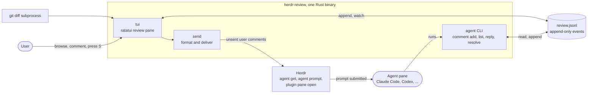

The new part compared with hunk is the arrow from `send` through Herdr into the agent. Everything
else is storage and UI.

## 2. What the three references do

### 2.1 hunk (what to keep, what to drop)

- TUI diff viewer (OpenTUI + Pierre diffs, run with Bun). Review stream of all files, sidebar,
  split and unified layouts, keys `[` `]` for hunks.
- Agent control is a CLI, `hunk session ...`, that talks to a local loopback daemon
  (`hunk daemon serve`). Every TUI registers itself with the daemon. Calls are authenticated with an
  owner-private credential and signed responses (`docs/agent-workflows.md`, `AGENTS.md`).
- Agent can: `session list|get|context|review`, `navigate`, `reload -- diff ...`,
  `comment add|apply|list|rm|clear`, `highlight add|clear`. `comment apply --stdin` takes a JSON batch.
- Notes are anchored by file, side (old or new) and line (`ReviewNoteV1` in
  `packages/hunk/src/core/review/types.ts`). Notes have `id`, `parentId` for replies, `source`
  (user or agent), `summary`, `rationale`, `author`, timestamps. Replies inherit the parent's anchor.
- Files are keyed by a content-derived key, not an index, so a reload keeps notes attached.
- Agents cannot create or edit user notes through the CLI, only list and remove them.

The gap: nothing pushes the user's notes to the agent. The user types a prompt, and the agent then
runs `hunk session comment list --type user`.

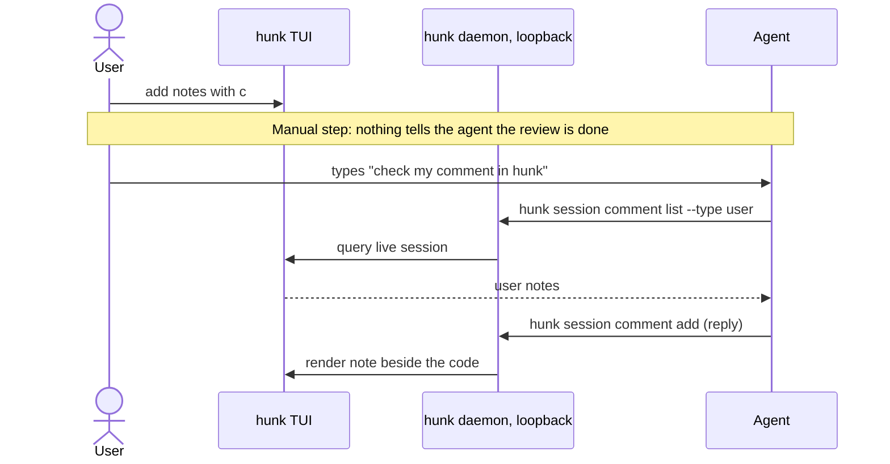

Keep: note model with replies, agent CLI shape, JSON batch apply, the skill document idea.
Drop: daemon, auth and signing, STML markup, extension system, highlight marks (for v1).

### 2.2 zeron (what to keep)

- gpui desktop app. Its worktree review is the model for the "user reviews and sends" flow, but the UI
  code is not reusable.
- `crates/ui/src/comments.rs` is the useful part. A `ReviewComment` has `path`, `line`, `body` and a
  source (`Diff { side: Old|New, old_path }` or `File`). Comments are staged on the composer, then
  `with_comments(text, comments)` appends a plain-text block to the next prompt:

  ```
  Address the review comments below.

  Comments on the diff (each cites the file and line it belongs to; L = line number in the original file, R = in the changed file):
  - src/lib.rs:42 (R): body text
    continued lines are indented by two spaces
  ```

  Details worth copying: an old-side comment on a renamed file cites the pre-rename path
  (`cite_path`), bodies are trimmed and indented, and the same block is parsed back out for display in
  the transcript (`extract_badge`). There is no second data model.
- Diff pipeline (`ARCHITECTURE.md` section 5): `git` subprocess instead of libgit2, patch plus numstat
  plus untracked files, 3 MiB cap, hash for change detection, fs watchers plus a slow repair poll.
- Zeron stages comments in the UI and sends them with the user's own prompt. Our plugin has no composer,
  so it must send the block itself.

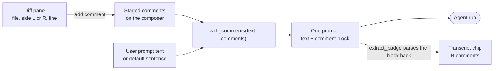

Our plugin keeps the middle of this picture (the block format) and replaces the composer with a Send key.

### 2.3 herdr-annotate and plannotator-tui (what to copy)

- `herdr-annotate` is already a Rust binary (ratatui 0.30, serde, chrono, uuid, rustix, signal-hook).
  It ships as a Herdr plugin with a prebuilt binary fetched by a build hook, a manifest with actions
  and panes, and CI. This is the closest template for packaging.
- Delivery to the agent, `rust/src/agent_delivery.rs`:
  - `herdr agent get <pane>` first. Refuses when status is `blocked`, when no agent is recognised, or
    when `launch_pending` is true.
  - Send mode: `herdr agent prompt <pane> <text>`. Paste mode: `herdr pane send-text` with a manual
    bracketed paste.
  - Strips ESC from the text so the content cannot end the bracketed paste early.
  - Archives annotations only after delivery succeeds. A refusal leaves them active.
- `rust/src/herdr.rs` wraps the `herdr` CLI via `HERDR_BIN_PATH`. `store.rs` has locked JSONL storage
  with golden tests. `editor.rs` and `edit_keys.rs` are a working multi-line comment editor for a
  ratatui popup.
- plannotator-tui (Rust + ratatui, not cloned) is launched by the plugin as
  `plannotator-tui herdr open|last|terminal`. The agent skill tells the agent to open a doc for review
  and end its turn. Feedback arrives as the next user message. The review pane learns where to deliver
  through `PLANNOTATOR_TUI_DELIVER_TO=<pane id>` set with `--env` when the pane is opened.
  This is the same push model we want.

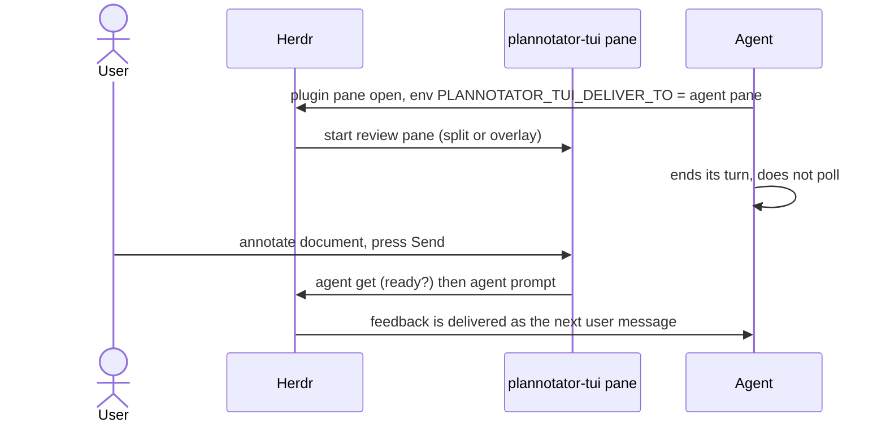

## 3. Herdr plugin surface (verified)

Sources: installed `herdr 0.9.1` help, Herdr 0.9.3 `plugins.mdx` and `socket-api.mdx`.

- Manifest `herdr-plugin.toml`: `[[build]]`, `[[startup]]`, `[[actions]]` (id, title, contexts, command),
  `[[events]]` (for example `worktree.created`), `[[panes]]` (placement `overlay|popup|split|tab|zoomed`),
  `[[link_handlers]]`. Commands are argv arrays, no shell.
- Environment injected into plugin commands: `HERDR_SOCKET_PATH`, `HERDR_BIN_PATH`, `HERDR_ENV=1`,
  `HERDR_PLUGIN_ID`, `HERDR_PLUGIN_ROOT`, `HERDR_PLUGIN_CONFIG_DIR`, `HERDR_PLUGIN_STATE_DIR`,
  `HERDR_PLUGIN_CONTEXT_JSON`, `HERDR_WORKSPACE_ID`, `HERDR_TAB_ID`, `HERDR_PANE_ID` (unset in popups).
  Context JSON includes workspace, tab, focused pane, worktree, agent and selected text.
  `herdr-annotate` reads `focused_pane_id`, `focused_pane_cwd`, `focused_pane_agent` from it.
- A plugin pane can be opened from any process:
  `herdr plugin pane open --plugin <id> --entrypoint <pane id> --placement split --direction right
  --target-pane <pane> --cwd <dir> --env K=V --focus`. The agent can do this itself (the plannotator
  skill does).
- Agent control from a plugin: `herdr agent list|get|read|prompt|wait|start|focus`, `herdr pane ...`,
  `herdr notification show`, `herdr worktree list|create|open|remove`. `agent prompt` honours the
  pane's bracketed-paste mode, rejects a `blocked` agent, and supports `--wait --timeout`.
- Agent states: `idle`, `working`, `blocked`, `done`, `unknown`. `idle` and `done` both mean ready.
- The socket API (newline-delimited JSON over a Unix socket or Windows named pipe) has
  `events.subscribe` with `pane.agent_status_changed`, `worktree.created` and others. Useful later,
  not needed for v1.
- Plugins have no Herdr-managed storage. State goes in `HERDR_PLUGIN_STATE_DIR` or
  `HERDR_PLUGIN_CONFIG_DIR`.
- Build hooks run on `plugin install` only, not on `plugin link`. So local development needs a
  staging script (see `herdr-annotate/scripts/stage-local.sh`).
- Herdr has native git worktree workspaces. A review target can be "the focused workspace's checkout",
  which covers what zeron's worktree feature does. `herdr worktree list` errors with
  `not_git_worktree` outside a repo, so the plugin must handle that.

Version caveat: the installed Herdr is 0.9.1 and its `plugin pane open --help` lists only
`overlay|split|tab|zoomed` and no `--width/--height`. The 0.9.3 docs add `popup` with width and height.
Set `min_herdr_version` deliberately, and use `split` or `overlay` for the main review pane so v1 does
not depend on `popup`. The small comment editor can stay inside the review TUI instead of a second pane.

## 4. Proposed design

### 4.1 Process model

Components and who calls whom:

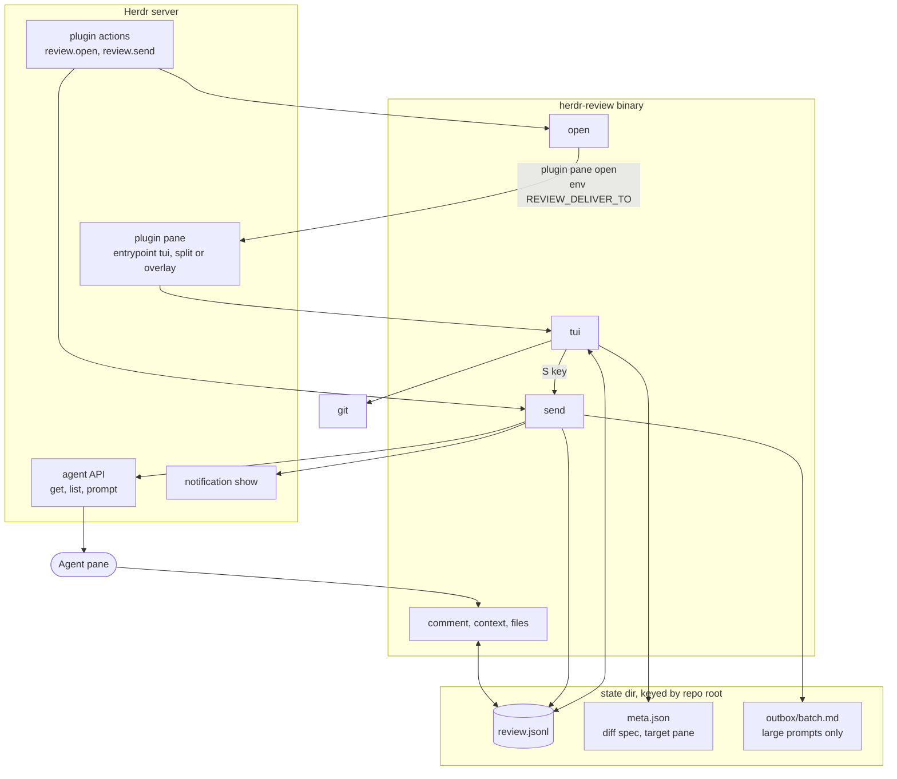

End-to-end flow for one review round:

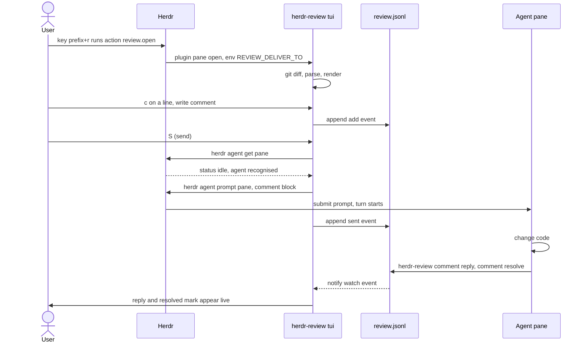

There is no step where the user types a prompt.

One binary, subcommands:

| Subcommand | Caller | Purpose |
|---|---|---|
| `tui` | Herdr plugin pane | Interactive review UI |
| `open` | Herdr action or keybinding | Resolve repo and agent pane from context, open the pane |
| `send` | Herdr action or TUI key | Format and deliver unsent user comments |
| `comment add\|apply\|list\|reply\|resolve\|reopen\|rm\|clear` | agent | Read and write the review. Agents may `rm` or edit only their own comments |
| `context`, `files` | agent | Show review target and file list, so the agent can anchor comments |
| `skill` | agent or user | Print the agent skill text with the absolute binary path filled in |
| `startup` | Herdr `[[startup]]` hook | Write the binary path where agents can find it (section 4.8) |
| `archive` | user (TUI key) | Move resolved comments to `archive.jsonl` |

### 4.2 Review identity and storage

- A review is keyed by the canonical repo or worktree root plus a diff spec. v1 has two specs:
  the working tree against `HEAD` (tracked and untracked files, like `hunk diff`) and `base...HEAD`
  for a whole branch. Staged-only and single-commit specs are later.
- Directory: `$XDG_STATE_HOME/herdr-review/<hash(root)>/` (macOS fallback `~/Library/Application Support`).
  It must not rely on `HERDR_PLUGIN_STATE_DIR`, because the agent CLI is not launched by Herdr as a
  plugin command and will not have that variable.
- Files in that directory: `review.jsonl` (comments, append-only events), `archive.jsonl` (archived
  comments, never loaded at startup), `meta.json` (diff spec, target pane, schema version), `lock`. Reuse the locking and torn-write handling from
  `herdr-annotate/rust/src/store.rs`.
- Event records rather than mutable rows, so concurrent writers (TUI and agent) never rewrite each
  other: `add`, `edit`, `resolve`, `reopen`, `delete`, `sent`, `seen`, `archive`. The reader folds them into
  current state.
- Comment fields, combining hunk's note and zeron's comment:

  | Field | Notes |
  |---|---|
  | `id` | uuid or short id (`u-7f3a`, `a-91c2`), short ids are easier for the agent to quote |
  | `parent_id` | reply threading, replies inherit the anchor (hunk) |
  | `author` | `user` or `agent:<name>` |
  | `path`, `old_path` | `old_path` for renames (zeron `cite_path`) |
  | `side`, `line`, `end_line` | old or new side, 1-based. `end_line` makes a range. A file-level comment has no `side` or `line` |
  | `anchor` | the line text and a few lines of context, plus a hash, to detect drift after the diff changes |
  | `body` | text |
  | `status` | `open` or `resolved`; `outdated` is computed when the anchor no longer matches, never stored |
  | `resolved_by`, `resolved_at` | who resolved it (`user` or `agent:<name>`) and when |
  | `seen` | set by a `seen` event when the user has looked at an agent's resolve, drives the `new` marker |
  | `sent_at`, `sent_batch` | set by `send`, so a second Send only carries new or reopened comments |
  | `created_at` | timestamp |

- Rights (decided):

  | Action | User | Agent |
  |---|---|---|
  | Add comment or reply | yes | yes |
  | Resolve or reopen any comment | yes | yes |
  | Edit or delete a comment | own only | own only |

  One resolved state. Either side can resolve either side's comment, instantly. The record says who
  did it, anyone can reopen, and the TUI marks agent-resolved comments `new` until the user has seen
  them. An agent can never alter or remove the user's words.
- Lifetime (decided): comments persist across restarts and agent sessions until the user archives
  them. The TUI has an archive key and the CLI has `comment clear --resolved`; both move resolved
  comments to `archive.jsonl`. Nothing is deleted without a request.
- Scope (decided): a comment attaches to one line, a line range on one side, or a whole file. There is
  no review-wide summary comment.

Shape of the data:

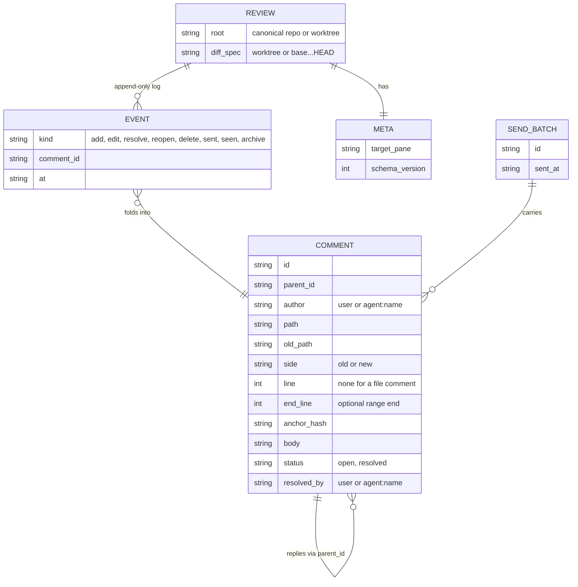

Comment lifecycle. `Outdated` is computed from the anchor and never stored, so it is not a state here:
an outdated comment is still open or resolved, only tagged. Nothing is auto-resolved when a fix moves the
line.

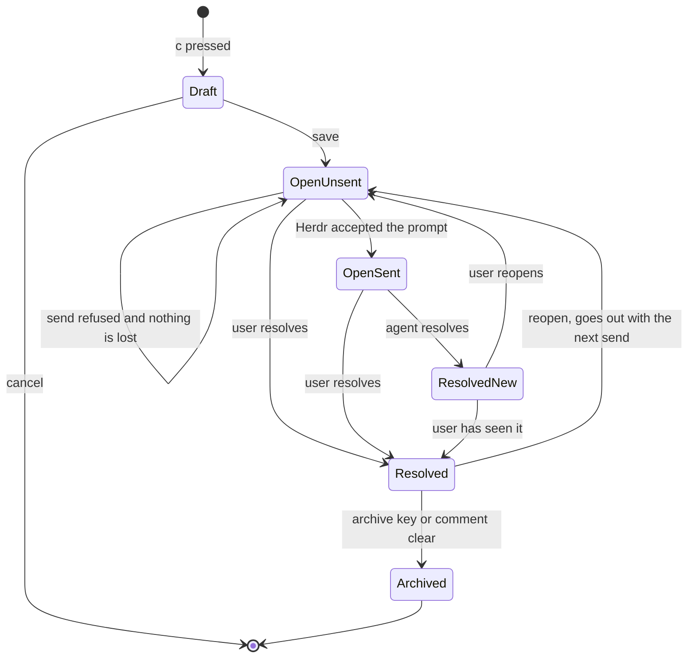

### 4.3 Diff source

- Shell out to `git` (as zeron does): `git diff HEAD --no-color --no-ext-diff -U3 -M` plus
  `git ls-files --others --exclude-standard` for untracked files (working-tree spec), and
  `git diff <base>...HEAD` for the branch spec.
- Default `<base>` is my assumption, not a decision: `origin/HEAD` if set, else `main`, else `master`.
  `herdr-review open --base <ref>` overrides it and the choice is saved in `meta.json`.
  No libgit2 or gix. This saves binary size and memory and matches `git`'s own rename detection.
- Parse unified diff by hand into `File { path, old_path, status, hunks[], binary, too_large }`.
  The format is small and a hand parser avoids a dependency. Cap total patch size (zeron uses 3 MiB)
  and mark oversized files as collapsed.
- Reload on file changes using `notify` on the worktree, debounced, plus a manual `r` key. Match old
  comments to the new diff by `path` plus anchor hash. Comments that no longer match are shown as
  outdated, not deleted.
- Word-level intra-line highlight with the `similar` crate (small, no deps).

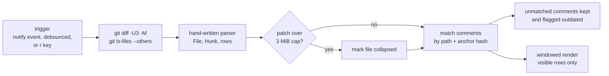

### 4.4 Syntax highlighting (the main memory decision)

| Option | Cost | Note |
|---|---|---|
| None in v1, only diff colours and intra-line emphasis | smallest | Honest baseline for the memory target |
| `syntect` with `fancy-regex` | several MB of syntax data when loaded, large binary | Mature, many languages, easy ratatui adapter (`syntect-tui`) |
| `tree-sitter` + `tree-sitter-highlight` | one grammar per language, each adds binary size | Better accuracy, more build complexity |

Decided: ship v1 without syntax colours. Later, add `syntect` behind a cargo feature and load grammars
lazily for the file currently on screen. Measure before deciding it stays on by default.

### 4.5 TUI

- `ratatui` and `crossterm`. Single-threaded event loop plus one watcher thread feeding an `mpsc`
  channel. No tokio.
- The pane opens as a split to the right of the agent (decided), so the agent stays visible. The user
  can zoom it with Herdr's pane zoom. A config setting can switch to `overlay` or `tab`.
- Layout follows hunk's rules in `AGENTS.md`: one top-to-bottom review stream of all files, a sidebar
  that jumps to a file, auto split or unified by width, `[` `]` between hunks, mouse and keyboard parity.
- Render only visible rows. Keep per-file hunk row counts so scrolling does not build full row lists
  for every file. This is where hunk and zeron spend effort (zeron's analytic row heights).
- Comment UI: `c` on a line opens an inline multi-line editor (copy `editor.rs` and `edit_keys.rs`
  from herdr-annotate). Comment cards render under the line, user and agent in different colours,
  threads indented, resolved ones collapsed. Agent-resolved comments carry a `new` marker until seen.
  Outdated comments carry an `outdated` tag, keep the original line text, and stay visible.
  A comment can attach to a line (`c`), a range (`v` to select, then `c`), or a file (`c` on the file
  header).
- Keys that matter for the new workflow: `c` comment, `r` reply, `x` resolve or reopen, `S` send unsent
  comments (submit), `p` paste them into the agent prompt without submitting, `n` `N` next or previous
  comment (hunk's `--next-comment`), `e` archive resolved, `A` ask the agent to review (later).
- `q` with unsent comments asks `send / keep for later / stay`. Comments are always on disk, so keep
  loses nothing.
- Status line shows delivery target and count: `Send 3 unsent > claude in w1:p2`, as plannotator does.

Rough layout (not a spec):

```
+- Files ----------+- src/lib.rs ------------------------------------------------+
| M src/lib.rs   2 |  @@ -38,6 +38,9 @@ fn parse()                                 |
|   src/cli.rs   1 |   38   38   let mut out = Vec::new();                        |
| A src/store.rs   | - 39        out.push(x);                                     |
| D old.rs         | + 39        out.extend(x);                                   |
|                  |  +-- user  u-7f3a  open ------------------------------+      |
|                  |  | Why not reserve capacity first?                     |      |
|                  |  |  +-- agent a-91c2 --------------------------------+ |      |
|                  |  |  | Added with_capacity, see next line             | |      |
|                  |  +--------------------------------------------------+      |
+------------------+--------------------------------------------------------------+
 c comment  r reply  x resolve  n/N next comment  [ ] hunk  S send 3 > claude w1:p2
```

### 4.6 Sending to the agent (the core feature)

1. Collect comments and replies with `author=user`, `status=open`, and no `sent_at`. A comment the
   user reopened counts as unsent again.
2. Format with zeron's block, extended with ids, the exact reply and resolve commands (absolute binary
   path from `HERDR_PLUGIN_ROOT`), and the instruction chosen in the grilling session: fix, reply in one
   line, then resolve; if unsure or in disagreement, reply and leave it open.

   ```
   Address the review comments below. For each one: make the change, add a one-line reply, then
   resolve it. If you disagree or are unsure, reply and leave it open.

   Reply:   /abs/path/herdr-review comment reply <id> "<text>"
   Resolve: /abs/path/herdr-review comment resolve <id>

   Comments on the diff (L = line in original file, R = in changed file):
   - [u-7f3a] src/lib.rs:42 (R): body text
     more lines indented
   - [u-81bd] src/lib.rs:50-57 (R): comment on a range
   - [u-90ce] src/store.rs (file): comment on the whole file
   - [u-a512] reply to a-91c2 ("Added with_capacity"): user reply text
   ```

3. Deliver with `agent_delivery::deliver_to_agent(Delivery::Send, pane, text, herdr)`:
   readiness check, ESC stripping, `herdr agent prompt`. Refusals (blocked, no agent, launch pending)
   leave comments unsent and show a message in the TUI, never lose data. A `working` agent is not
   refused (decided): the TUI says `agent is working, comments queued`. Claude Code queues the message;
   other agents are checked after the first pass.
4. Mark comments `sent` only after Herdr accepted the prompt.
5. Size rule: if the block exceeds a threshold (start with about 8 KB), write it to
   `<state>/outbox/<batch>.md` and send a short prompt that names the file. This avoids huge pastes into
   agent prompts. Needs a test with real agents; it is an assumption.
6. Second delivery mode on `p`: `Paste` fills the agent prompt without submitting, as herdr-annotate
   does. Submit is the default (decided).

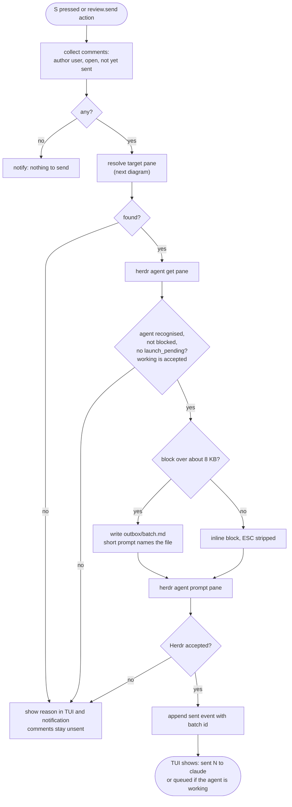

Target pane resolution, in order: `REVIEW_DELIVER_TO` env (set when the pane is opened by the `open`
action or by the agent), then the target saved in `meta.json` if that pane still hosts an agent, then
the agent in the same workspace whose `cwd` is inside the review root (`herdr agent list`), then ask
the user to pick when more than one matches. Store the choice in `meta.json`.

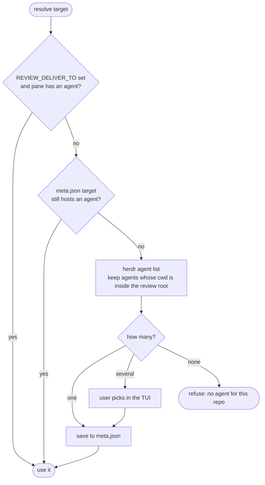

### 4.7 Agent side

- Skill (`skills/herdr-review/SKILL.md`, generated from the binary like hunk's skill so docs and
  behaviour cannot drift) says: only when `HERDR_ENV=1`; run `herdr-review comment list --status open
  --author user --json` when told there are comments; reply with `comment reply <id>` and `comment
  resolve <id>` after fixing, as the sent prompt asks; to start a review of your own changes run
  `herdr-review comment apply --stdin` with a JSON batch, then `herdr-review open` so the user sees it.
- Binary path (decided: absolute path, no PATH change): the sent prompt carries the full path. The
  skill needs it before any Send has happened, so the `startup` hook writes the path to
  `$(herdr plugin config-dir review)/binary-path` and the skill tells the agent to read that file. This
  mechanism is my assumption and is listed as open in section 9.
- With push delivery the skill rarely needs the agent to poll. The prompt already carries the comments.
  The CLI is for replies, for agent-initiated review, and for recovery when a prompt is long.
- Agent-initiated review ("agent can do code review by giving a comment"), decided: the agent writes
  comments with `author=agent:<name>`, then runs `herdr-review open`, which opens the review pane
  beside it. The CLI also calls `herdr notification show` ("N review comments from claude"). If the
  pane is already open, the comments appear live through the watcher. The user can reply, resolve or
  reopen, and `S` sends the new replies back.

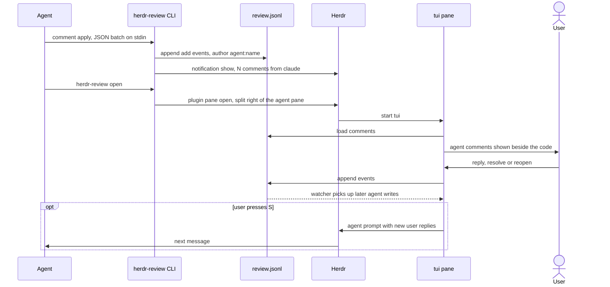

- Reverse direction, `A` in the TUI: send the agent a fixed prompt "Review the current diff and leave
  comments with herdr-review", or start a separate reviewer with
  `herdr agent start reviewer --kind codex --pane <new split>`. Nice fit with Herdr's own primitives,
  can wait for v2.

### 4.8 Plugin manifest sketch

```toml
id = "review"
name = "Review"
version = "0.1.0"
min_herdr_version = "0.9.1"
platforms = ["macos", "linux"]

[[build]]
platforms = ["macos", "linux"]
command = ["bash", "scripts/fetch-herdr-review.sh"]   # prebuilt binary + SHA-256, as herdr-annotate

[[startup]]
command = ["./bin/herdr-review", "startup"]   # writes the binary path for agents

[[actions]]
id = "open"
title = "Review: open diff"
contexts = ["workspace", "pane"]
command = ["./bin/herdr-review", "open"]

[[actions]]
id = "send"
title = "Review: send comments to agent"
contexts = ["pane"]
command = ["./bin/herdr-review", "send"]

[[panes]]
id = "tui"
title = "Review"
placement = "split"        # `open` passes --direction right and --target-pane <agent pane>
command = ["sh", "-c", "exec \"$HERDR_PLUGIN_ROOT/bin/herdr-review\" tui"]
```

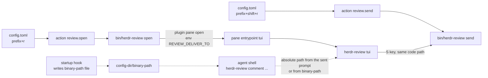

Keybindings go in the user's Herdr `config.toml` (`type = "plugin_action"`), as in the
herdr-annotate README. `herdr-annotate` already uses `prefix+a`, `prefix+o`, `prefix+m`; pick
unused keys such as `prefix+r`.

Agent access to the binary (decided): no PATH change and no symlink. Agents get the absolute path
from the sent prompt (section 4.6) and, for agent-initiated reviews, from the `binary-path` file the
startup hook writes (section 4.7). The skill must tolerate the plugin moving: it reads the file each
time instead of caching the path.

## 5. Memory and speed plan

hunk is a Bun-compiled TypeScript app (its `bin/hunk` here is a wrapper script around the Nix-built
package) plus a daemon. I did not measure its resident memory because no hunk process was running, so
the saving is unquantified. Measure before and after with `/usr/bin/time -l` on macOS (peak RSS) against
the same repo and diff.

Rules that keep a Rust version small:

- No async runtime. `std::thread` and `mpsc`. `notify` for watching.
- No git library. `git` subprocess, output parsed in a streaming pass.
- Parse the diff once into compact structures (offsets into one `String`, not a `String` per line).
- Render windowed. Do not materialise styled rows for files that are off screen.
- Highlighting is optional and lazy (section 4.4).
- Release profile as in herdr-annotate (`lto = "thin"`, `strip = true`), then try `opt-level = "s"`,
  `codegen-units = 1`, `panic = "abort"` and compare.
- Store comments as JSONL, load on open, keep in a `Vec`. A review has hundreds of comments at most.

Suggested budget to set up front (to be validated): cold start under 50 ms on a 50-file diff, resident
memory in the low tens of MB on the same diff, binary under 5 MB without syntax highlighting.

## 6. What to reuse, file by file

| Need | Source | Action |
|---|---|---|
| Agent readiness, send, paste, ESC stripping | `herdr-annotate/rust/src/agent_delivery.rs` | Copy, keep tests |
| `herdr` CLI wrapper, notifications | `herdr-annotate/rust/src/herdr.rs` | Copy |
| Locked JSONL store | `herdr-annotate/rust/src/store.rs` | Adapt to event records |
| Multi-line comment editor | `herdr-annotate/rust/src/editor.rs`, `edit_keys.rs`, `width.rs` | Adapt for inline use |
| Manifest, fetch scripts, CI, smoke test | `herdr-annotate/herdr-plugin.toml`, `scripts/`, `.github/` | Adapt |
| Cargo lints and release profile | `herdr-annotate/rust/Cargo.toml` | Copy |
| Prompt format and rename-aware citation | `zeron/crates/ui/src/comments.rs` | Port the logic, not the gpui code |
| Note model with replies and anchors | `hunk/packages/hunk/src/core/review/types.ts` | Simplify |
| CLI shape and skill text | `hunk/packages/hunk/skills/hunk-review/SKILL.md` | Mirror command names where they fit |
| Plugin pane + deliver-to pattern | `herdr-annotate/skills/plannotator-tui/SKILL.md` | Same approach |

## 7. Risks and unknowns

- Herdr version: popup placement and sizing need newer Herdr than the installed 0.9.1. Plan around
  `split` and `overlay`, and confirm what `plugin pane open` accepts on the target version.
- Agent CLI discovery is settled (absolute path), but the `startup` hook plus `binary-path` file is
  untested: confirm that `[[startup]]` runs on `plugin link` sessions and that `plugin config-dir`
  resolves for a plugin the agent did not launch.
- Sending to a `working` agent is allowed (decided). `agent get` accepts it and Claude Code queues
  input. First pass covers Claude Code only (decided); Codex and pi are checked afterwards and may need
  fixes.
- A queued prompt can arrive after the agent already moved on. The `sent` event prevents resending the
  same comment; reopening is the only way back.
- Large prompts: the file-pointer fallback (section 4.6 step 5) is untested.
- Anchor drift: matching by hash plus context handles common edits; heavy refactors will mark comments
  outdated. Acceptable if outdated comments stay visible.
- Two writers on one JSONL file: safe with append-only events and `flock`, but needs a concurrency
  test (TUI and agent writing together), like herdr-annotate's stale-lock goldens.
- Agent-authored comment text is untrusted input rendered in the user's terminal. Strip control
  characters and ESC before rendering. The reverse direction already strips ESC for the paste.
- Windows: Herdr plugin support on Windows is preview. Skip in v1; the design has no Unix-only
  dependency except the optional file lock and `rustix`.
- Scope creep from hunk: highlight marks, rich markup, live `reload` from the agent, extensions.
  None are needed for the stated goal.

## 8. Milestones

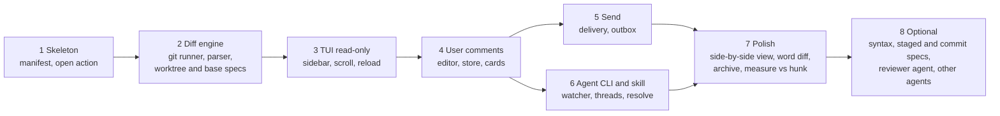

Milestones 5 and 6 can run in parallel once comments exist. The first useful version is the end of 5
plus the `comment reply` and `comment resolve` commands from 6.

1. Skeleton: Cargo project, `herdr-plugin.toml`, stage and link scripts, `open` action opens a pane that
   prints the context. Confirms placement and env on the user's Herdr.
2. Diff engine: `git` runner for the working-tree and `base...HEAD` specs, parser, tests on fixture
   patches (renames, binary, no newline at EOF, untracked, large file cap).
3. TUI read-only: file sidebar, unified view, scrolling, hunk keys, reload.
4. User comments: editor, store, comment cards on lines, ranges and files, edit and delete own.
5. Send: formatter, delivery with readiness check, mark-sent, outbox fallback, notifications.
6. Agent CLI and skill: `comment add|apply|list|reply|resolve|reopen`, live watcher, threads, resolve
   state with `new` marker, `startup` hook, notification on agent comments, `open` from the agent.
7. Polish: side-by-side diff view, word diff, outdated tag, archive, quit prompt, measure memory
   against hunk.
8. Optional: lazy syntax highlighting, staged and single-commit specs, `A` ask-agent, reviewer agent in
   a split, worktree-created event hook, Codex and pi verification fixes.

## 9. Decisions log

Decided in the grilling session on 2026-10-04.

| # | Topic | Decision |
|---|---|---|
| 1 | Resolve | Anyone resolves or reopens any comment instantly. One resolved state, `resolved_by` recorded, `new` marker on agent resolves until the user sees them |
| 2 | Send default | Submit with `herdr agent prompt`. `p` pastes without submitting |
| 3 | Agent finds binary | Absolute path in the sent prompt and the generated skill. No PATH change, no symlink |
| 4 | Diff scope v1 | Working tree against `HEAD` (including untracked) plus `base...HEAD`. Staged and single-commit later |
| 5 | Busy agent | Send anyway and say it is queued. Refuse only blocked, missing or launching agents |
| 6 | Comment scope | Line, line range, whole file. No review-wide summary |
| 7 | Lifetime | Persist until the user archives. Archive moves resolved comments to `archive.jsonl` |
| 8 | Agent-initiated review | Agent runs `herdr-review open` and a notification fires. Live updates if the pane is open |
| 9 | Prompt wording | Tell the agent to fix, reply in one line, then resolve. If unsure, reply and leave open |
| 10 | Outdated comments | Keep, tag `outdated`, show the original line text, never auto-resolve |
| 11 | Syntax highlighting | None in v1. Later behind a cargo feature, loaded lazily |
| 12 | Names and keys | Plugin id `review`, binary `herdr-review`, `prefix+r` open, `prefix+shift+r` send |
| 13 | Placement | Split to the right of the agent pane (vertical divider). User zooms when needed |
| 14 | Quit with unsent | Ask: send, keep for later, or stay |
| 15 | Agent rights | Reply, resolve, reopen any comment. Edit or delete only their own. Same for the user |
| 16 | First test pass | Claude Code only. Codex and pi afterwards |

### Defaults I chose without asking

Say so if any of these is wrong.

- Default `<base>` for the branch spec is `origin/HEAD`, else `main`, else `master`, overridable with `--base`.
- The `startup` hook writes the binary path to `$(herdr plugin config-dir review)/binary-path` so the
  skill can find the binary before any Send. Needs the check listed in section 7.
- Windows is out of v1.
- Prompts over about 8 KB go through an outbox file (section 4.6). The threshold is a guess.
- Reviews are keyed by repo or worktree root, so two agents in one repo share one review. The target
  agent is chosen by the resolution order in section 4.6.
- The user can edit and delete their own comments, including after they were sent (the agent sees the
  change only on the next send).

### Still open

- Does the pane's `placement = "split"` in the manifest accept a direction, or must `open` always pass
  `--direction right`? Check on the target Herdr version in milestone 1.
- Whether `[[startup]]` runs under `herdr plugin link` during development, which affects how the skill
  finds the binary in local builds.
- How edited-after-sent comments should be treated: resend on edit, or leave until the user asks.
